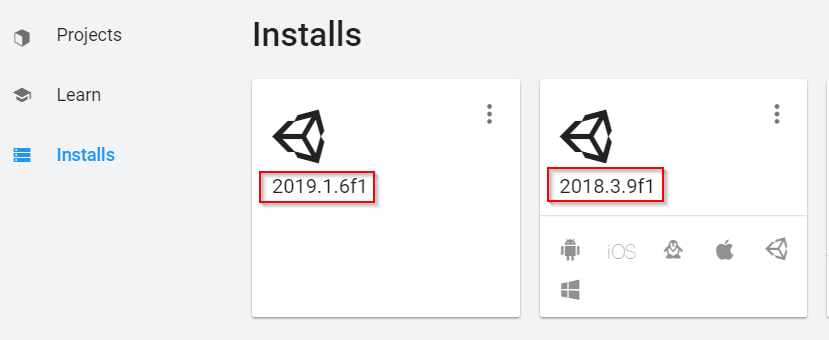

# Unity Assemblies

This repository contains the source code for the [`UnityEngine` NuGet package](https://www.nuget.org/packages/UnityAssemblies).

`UnityEngine` allows developers to effectively reference assemblies of the Unity game engine (e.g., `UnityEngine.dll`) as NuGet packages.

## Usage

Here is a minimal example of `.csproj` file making use of this package. The project is targeting .NET Standard and referencing the `UnityEngine` assembly from Unity 2019.1.6f1:

```xml
<Project Sdk="Microsoft.NET.Sdk">
    <PropertyGroup>
        <TargetFramework>netstandard2.0</TargetFramework>
        <UnityVersion>2019.1.6f1</UnityVersion>
    </PropertyGroup>
    <ItemGroup>
        <PackageReference Include="UnityEngine" Version="1.*" />
    </ItemGroup>
</Project>
```

As you can see, our package requires a `UnityVersion` property for the version of Unity whose assemblies you want to reference. `UnityVersion` must be a complete version string, in the format used by Unity Hub (the values boxed in red in the screenshot below).



By default, we only add a reference to `UnityEngine`, but there are several other references to which you can opt in. To add a reference to Unity assembly `X`, add a `<ReferenceX>true</ReferenceX>` property to your `.csproj`. The supported `ReferenceX` properties are:

| Property | Unity assembly referenced | Default | Path property | Use case |
|----------|---------------------------|---------|---------------|----------|
| `ReferenceUnityEngine` | UnityEngine | `true` | `$(UnityEngineAssembly)` | Projects with any classes that inherit `MonoBehaviour` or reference Unity types. |
| `ReferenceUnityEditor` | UnityEditor | `false` | `$(UnityEditorAssembly)` | Projects with Editor scripts (e.g., classes inheriting `Editor`, `EditorWindow`, or `PropertyDrawer`). |
| `ReferenceUnityEngineUi` | UnityEngine.UI | `false` | `$(UnityEngineUiAssembly)` | Projects that reference Unity UI types (e.g., `Text`, `Image`, `Button`). |
| `ReferenceUnityEngineTestRunner` | UnityEngine.TestRunner | `false` | `$(UnityEngineTestRunnerAssembly)` | Projects with NUnit tests to be run by the Unity Test Runner. |

So, for example, if you were writing an Editor plugin that needed to reference `UnityEngine`, `UnityEngine.UI`, and `UnityEditor`, then your `.csproj` would include the following properties:

```xml
<ReferenceUnityEngine>true</ReferenceUnityEngine>   <!-- Optional -->
<ReferenceUnityEditor>true</ReferenceUnityEditor>
<ReferenceUnityEngineUi>true</ReferenceUnityEngineUi>
```

Because Unity Hub is the tool [recommended by Unity Technologies](https://docs.unity3d.com/Manual/GettingStartedInstallingUnity.html) for installing Unity, we check for Unity assemblies within the Hub's default install locations, which are:

- **Windows**: C:\Program Files\Unity\Hub\Editor
- **Mac**: /Application/Unity/Hub/Editor

If you are not using Unity Hub, or you are using a custom install location, then you must add a `UnityLocation` property to indicate where your Unity versions are installed. For example, if you were using a Windows machine and your Unity versions were installed in a `Unity\` folder on your `V:` drive, then your `.csproj` would look something like:

```xml
<PropertyGroup>
    <!-- ... -->
    <UnityVersion>2019.1.6f1</UnityVersion>
    <UnityLocation>V:\Unity</UnityLocation>
</PropertyGroup>
<!-- ... -->
```

If for any reason you need to customize the actual `Reference` items used in your project, then we also provide a set of MSBuild properties with the actual paths of the various Unity assemblies. These properties were given in the `Path property` column of the table above. For example, to explicitly add a reference to `UnityEngine.UI.dll`, your `.csproj` would include the following lines:

```xml
<Reference Include="UnityEngine.UI.dll">
    <HintPath>$(UnityEngineUiAssembly)</HintPath>
</Reference>
```

## FAQ

### How is this legal?

We're not actually distributing the UnityEngine DLLs, just MSBuild properties that reference them. This NuGet package won't do anything (except show a warning) if you don't actually have a version of Unity installed.

### How does this work?

Through a little bit of MSBuild magic. When you add `<ReferenceX>true</ReferenceX>` to your project file, we are adding an MSBuild `Reference` item to assembly `X` behind the scenes. So, in effect, this NuGet just saves you the clicks of adding an assembly reference within Visual Studio. However, if you did add a reference manually, then the `HintPath` would be platform-specific; i.e., if you added the reference on a Windows machine, then the reference path would not exist on a Mac machine. This NuGet sets the assembly paths based on the current OS, so the references will work cross-platform.
